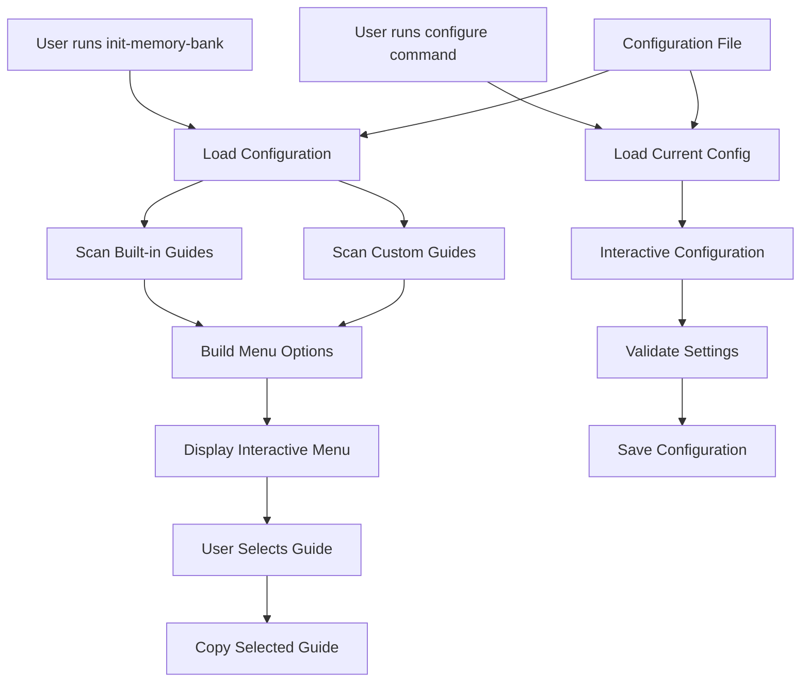
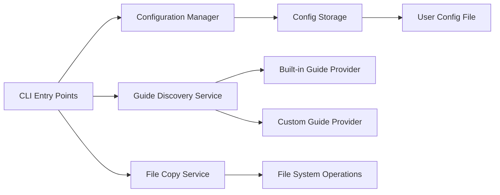

# Custom Development Guides Feature Design

## Overview

This design document outlines the architecture and implementation approach for the custom development guides feature. The feature extends the existing memory-bank CLI tool to support user-defined development guides while maintaining backward compatibility and providing a seamless user experience.

## Architecture

### High-Level Architecture



### Component Architecture



## Data Models

### Configuration Schema

```typescript
interface CustomGuideConfig {
  customGuidesFolder: string;
  menuItems: CustomMenuItem[];
  version: string;
}

interface CustomMenuItem {
  id: string;
  displayName: string;
  folderPath: string;
  category?: string;
  description?: string;
}

interface GuideInfo {
  id: string;
  displayName: string;
  type: 'built-in' | 'custom';
  folderPath: string;
  hasCursorRules: boolean;
  category?: string;
  description?: string;
}
```

### File Structure

```
Custom Guides Folder Structure:
~/custom-dev-guides/
├── company-react/
│   ├── developmentGuide.md
│   └── .cursorrules (optional)
├── microservices/
│   ├── developmentGuide.md
│   └── .cursorrules (optional)
└── legacy-java/
    ├── developmentGuide.md
    └── .cursorrules (optional)
```

## Core Components

### 1. Configuration Manager

**Purpose**: Manages user configuration for custom development guides.

**Responsibilities**:
- Load/save configuration from user's home directory
- Validate configuration settings
- Provide default configuration
- Handle configuration migration

**Key Methods**:
```typescript
class ConfigurationManager {
  loadConfig(): CustomGuideConfig
  saveConfig(config: CustomGuideConfig): void
  validateConfig(config: CustomGuideConfig): ValidationResult
  getDefaultConfig(): CustomGuideConfig
  resetToDefault(): void
}
```

**Configuration File Location**: `~/.memory-bank/config.json`

### 2. Guide Discovery Service

**Purpose**: Discovers and validates both built-in and custom development guides.

**Responsibilities**:
- Scan built-in guides from package resources
- Scan custom guides from configured folder
- Validate guide structure and required files
- Generate unified list of available guides

**Key Methods**:
```typescript
class GuideDiscoveryService {
  discoverBuiltInGuides(): GuideInfo[]
  discoverCustomGuides(config: CustomGuideConfig): GuideInfo[]
  validateGuide(folderPath: string): ValidationResult
  getAllGuides(config: CustomGuideConfig): GuideInfo[]
}
```

### 3. File Copy Service

**Purpose**: Handles copying of development guides and associated files to target projects.

**Responsibilities**:
- Copy developmentGuide.md files
- Copy .cursorrules files when present
- Maintain proper file structure in target project
- Handle file conflicts and overwrites

**Key Methods**:
```typescript
class FileCopyService {
  copyGuide(guideInfo: GuideInfo, targetDir: string): CopyResult
  copyCursorRules(guideInfo: GuideInfo, targetDir: string): CopyResult
  validateTargetDirectory(targetDir: string): ValidationResult
}
```

### 4. CLI Commands

#### Main Command (`init-memory-bank`)
- Enhanced to include custom guides in menu options
- Maintains backward compatibility
- Provides unified experience for all guide types

#### Configuration Command (`configure`)
- Interactive configuration interface
- Validation and error handling
- Configuration persistence

## Implementation Details

### Configuration Storage

**File**: `~/.memory-bank/config.json`
**Format**: JSON
**Default Structure**:
```json
{
  "version": "1.0.0",
  "customGuidesFolder": "~/custom-dev-guides",
  "menuItems": []
}
```

### Guide Validation Rules

1. **Required Files**:
   - `developmentGuide.md` (must exist and be readable)

2. **Optional Files**:
   - `.cursorrules` (if present, must be readable)

3. **Folder Structure**:
   - Each guide must be in its own subfolder
   - Folder name becomes default display name
   - Supports nested organization (categories)

### Error Handling Strategy

1. **Configuration Errors**:
   - Invalid folder paths → Clear error message with suggestions
   - Missing required files → Warning with specific file names
   - Permission issues → Clear instructions for resolution

2. **Runtime Errors**:
   - Missing custom guides folder → Fallback to built-in guides only
   - Invalid guide structure → Skip invalid guides with warnings
   - File copy failures → Detailed error messages with recovery steps

3. **Recovery Mechanisms**:
   - Configuration backup before changes
   - Automatic fallback to defaults on critical errors
   - Clear instructions for manual recovery

### User Experience Flow

#### Initial Setup
1. User runs `npx @zacfermanis/memory-bank configure`
2. Tool detects no existing configuration
3. Prompts for custom guides folder location
4. Validates and saves configuration
5. Scans for available custom guides
6. Allows customization of menu items

#### Normal Usage
1. User runs `npx @zacfermanis/memory-bank`
2. Tool loads configuration
3. Discovers built-in and custom guides
4. Displays unified menu with all options
5. User selects desired guide
6. Tool copies guide files to project

#### Configuration Updates
1. User runs configure command
2. Tool loads current configuration
3. Provides options to modify settings
4. Validates changes before saving
5. Confirms successful update

## Testing Strategy

### Unit Tests
- Configuration manager operations
- Guide discovery and validation
- File copy operations
- Error handling scenarios

### Integration Tests
- End-to-end CLI command execution
- Configuration persistence and loading
- File system operations
- Cross-platform compatibility

### Test Data
- Mock custom guides with various structures
- Invalid configurations for error testing
- Different file permission scenarios

## Security Considerations

1. **File System Access**:
   - Validate all file paths before operations
   - Prevent directory traversal attacks
   - Handle permission errors gracefully

2. **Configuration Security**:
   - Validate JSON configuration structure
   - Sanitize user input for file paths
   - Prevent malicious configuration injection

3. **Error Information**:
   - Avoid exposing sensitive file system information
   - Provide helpful error messages without security risks

## Performance Considerations

1. **Guide Discovery**:
   - Cache discovered guides during session
   - Lazy load guide content when needed
   - Optimize file system scanning

2. **Configuration Loading**:
   - Load configuration once per session
   - Validate configuration on load, not on every operation
   - Use efficient JSON parsing

3. **File Operations**:
   - Stream large files when copying
   - Use efficient file system APIs
   - Minimize unnecessary file operations

## Migration Strategy

### Version 1.0.0
- Initial implementation with basic custom guide support
- Simple configuration management
- Backward compatibility with existing functionality

### Future Enhancements
- Guide categories and organization
- Guide templates and sharing
- Advanced configuration options
- Integration with external guide repositories

## Dependencies

### New Dependencies
- None required (using existing Node.js fs and path modules)

### Updated Dependencies
- None (maintains current dependency set)

## File Structure Changes

### New Files
```
src/
├── config/
│   ├── configuration-manager.ts
│   └── types.ts
├── services/
│   ├── guide-discovery-service.ts
│   └── file-copy-service.ts
├── commands/
│   └── configure.ts
└── utils/
    └── validation.ts
```

### Modified Files
```
src/
└── index.ts (enhanced to support custom guides)
```

## Error Messages and User Feedback

### Success Messages
- "✅ Custom guides folder configured successfully"
- "✅ Found 3 custom development guides"
- "✅ Configuration saved successfully"

### Warning Messages
- "⚠️  Custom guides folder not found, using built-in guides only"
- "⚠️  Guide 'company-react' missing required file: developmentGuide.md"

### Error Messages
- "❌ Invalid folder path: /invalid/path"
- "❌ Permission denied accessing custom guides folder"
- "❌ Configuration file corrupted, resetting to defaults"

## Documentation Requirements

### README Updates
- Feature overview and benefits
- Setup instructions for custom guides
- Configuration command usage
- File structure examples
- Troubleshooting guide

### Code Documentation
- JSDoc comments for all public APIs
- Inline comments for complex logic
- Architecture decision records (ADRs) 