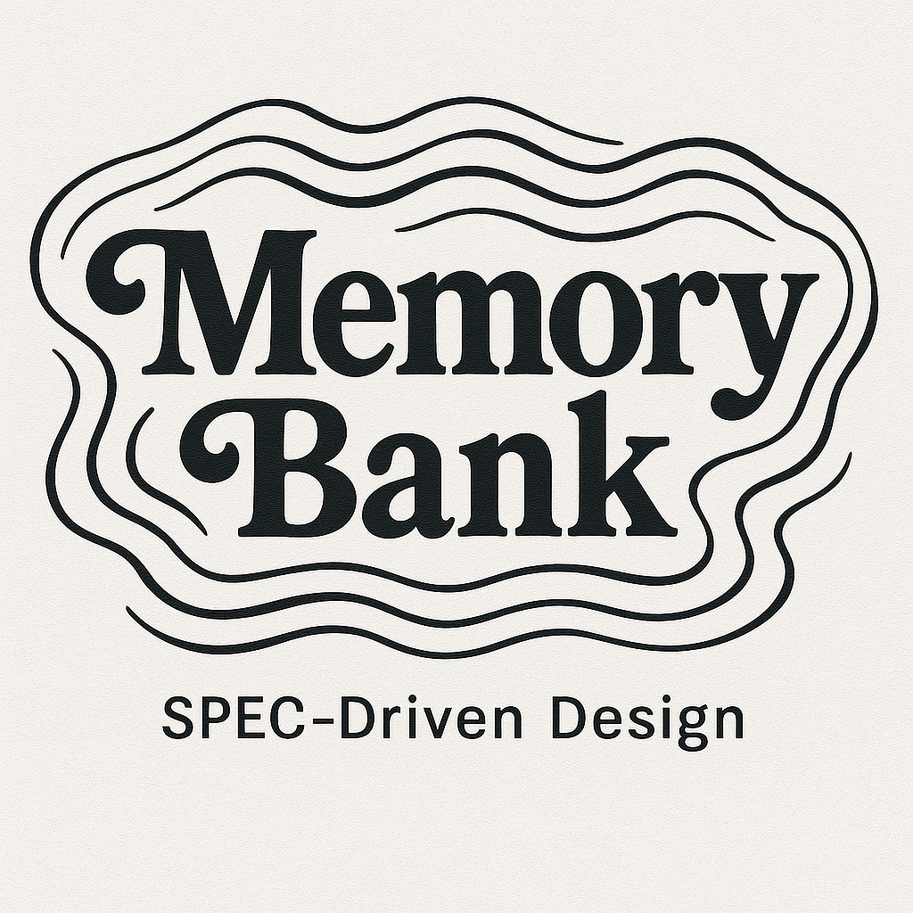

# Memory Bank for Agents

<div align="center">
  
  <br>
  <strong>A powerful CLI tool for AI-powered development documentation and project memory management supporting Web, Lua, and Java development</strong>
</div>

---

## 🚀 Overview

Memory Bank for Agents is a modern command-line interface that initializes AI-ready development environments with comprehensive documentation systems, cursor rules, and memory management tools. Perfect for Web (TypeScript/React/Next.js), Lua (Love2D game development), and Java (Spring Boot) development workflows.

## ✨ Features

- **🎯 AI-Ready Setup**: Pre-configured environments optimized for AI agent collaboration
- **📚 Memory Management**: Structured documentation system for project knowledge retention
- **⚡ Cursor Integration**: Custom `.cursorrules` for enhanced IDE experience
- **🛠️ Multi-Platform Support**: TypeScript/React/Next.js, Lua/Love2D, and Java/Spring Boot development
- **🔧 Custom Development Guides**: Extend with your own proprietary development practices
- **📋 SPEC-Driven Development**: Systematic feature development workflow
- **🔧 Zero-Configuration**: Works out of the box with sensible defaults

## 📦 Installation

### Global Installation (Recommended)

```bash
npm install -g @zacfermanis/memory-bank
```

### One-time Usage

```bash
npx init-memory-bank
```

## 🎮 Usage

### Supported Development Environments

Memory Bank for Agents supports built-in and custom development environments:

#### Built-in Environments
- **🌐 Web Development** - TypeScript, React, Next.js, and modern web technologies
- **🎮 Lua Development** - Lua programming language and Love2D game framework
- **☕ Java Development** - Java programming language and Spring Boot framework

#### Custom Development Guides
- **🔧 Custom Guides** - Your own proprietary development practices and company-specific guidelines
- **🏢 Company Standards** - Internal coding standards, architecture patterns, and best practices
- **🎯 Team Workflows** - Custom development workflows and team-specific processes

Each environment comes with:
- Customized development guidelines and best practices
- Technology-specific architecture patterns
- Optimized `.cursorrules` for AI collaboration
- Comprehensive documentation templates

### Quick Start

1. **Navigate to your project directory:**
   ```bash
   cd your-project
   ```

2. **Run Memory Bank for Agents:**
   ```bash
   npx init-memory-bank
   ```

3. **Choose your development environment:**
   - **🌐 Web** - TypeScript/React/Next.js development
   - **🎮 Lua** - Lua/Love2D game development
   - **☕ Java** - Java/Spring Boot development

### Interactive Setup

Memory Bank for Agents will guide you through an interactive setup process:

```
🚀 Memory Bank Initializer
==========================

📝 Available development guides:
   1. 📦 Lua - For Lua/Love2D game development
   2. 📦 Web - For TypeScript/React/Next.js development
   3. 📦 Java - For Java/Spring Boot development
   4. 🔧 Company React (Custom) - Internal React standards
   5. 🔧 Microservices (Custom) - Microservice architecture patterns

? What type of memory bank would you like to install?
  ❯ Lua - For Lua/Love2D game development
    Web - For TypeScript/React/Next.js development
    Java - For Java/Spring Boot development
    Company React (Custom) - Internal React standards
    Microservices (Custom) - Microservice architecture patterns
```

## 📁 Project Structure

After initialization, your project will have the following structure:

```
your-project/
├── .memory-bank/           # AI memory and documentation system
│   └── developmentGuide.md # Development guidelines and best practices (copied from selected guide)
├── .specs/                 # Feature specifications and requirements (empty directory)
└── .cursorrules           # IDE configuration for AI collaboration (copied from selected guide if available)
```

Memory Bank for Agents creates the foundation structure by copying the selected development guide's files. You can then expand the Memory Bank system by creating additional documentation files as needed.

## 🔧 Development Setup

### 🧠 Creating Memory Bank Files

After installation, you can create the complete Memory Bank documentation system by running this command in your AI agent:

```
initialize memory bank
```

This will create all the necessary Memory Bank files:
- `projectBrief.md` - Project foundation and goals
- `productContext.md` - Product vision and user experience  
- `activeContext.md` - Current work focus and decisions
- `systemPatterns.md` - Architecture and technical patterns
- `techContext.md` - Technology stack and setup
- `progress.md` - Project status and milestones

### 📋 SPEC-Driven Feature Development

After initializing your Memory Bank, you can use the SPEC-driven design process to systematically develop new features. When you want to create a new feature, use this prompt with your AI agent:

```
using the SPEC driven design process, create a new feature that: [describe your feature]
```

For example:
```
using the SPEC driven design process, create a new feature that: allows users to export their memory bank data to JSON format
```

The SPEC process will guide you through:
1. **Requirements Phase** - Define user stories and acceptance criteria
2. **Design Phase** - Create architecture and component design
3. **Tasks Phase** - Break down implementation into actionable tasks

This ensures systematic, well-documented feature development that integrates seamlessly with your Memory Bank system.

**Example Memory Bank Structure** (simulates an initialized repo with 1 feature):
```
your-project/
├── .memory-bank/           # AI memory and documentation system
│   ├── projectBrief.md     # Project foundation and goals
│   ├── productContext.md   # Product vision and user experience
│   ├── activeContext.md    # Current work focus and decisions
│   ├── systemPatterns.md   # Architecture and technical patterns
│   ├── techContext.md      # Technology stack and setup
│   ├── progress.md         # Project status and milestones
│   └── developmentGuide.md # Development guidelines and best practices
├── .specs/                 # Feature specifications and requirements
│   └── {feature-name}/     # Individual feature documentation
│       ├── requirements.md # User stories and acceptance criteria
│       ├── design.md       # Architecture and component design
│       └── tasks.md        # Implementation tasks and checklist
└── .cursorrules           # IDE configuration for AI collaboration
```

## 🧠 Memory Bank System

### Core Components

- **Project Brief**: Foundation document defining core requirements and goals
- **Product Context**: User experience goals and problem-solving approach
- **Active Context**: Current work focus, recent changes, and next steps
- **System Patterns**: Architecture decisions and technical patterns
- **Tech Context**: Technology stack, dependencies, and development setup
- **Progress Tracking**: What works, what's left to build, and known issues

### Memory-Driven Development

The Memory Bank system ensures:
- **Consistent Context**: AI agents maintain project understanding across sessions
- **Knowledge Retention**: Important decisions and patterns are preserved
- **Efficient Onboarding**: New team members can quickly understand project state
- **Quality Assurance**: Systematic documentation prevents knowledge loss

## 🔧 Custom Development Guides

Memory Bank for Agents supports custom development guides, allowing you to extend the tool with your own proprietary development practices, company standards, and team-specific workflows.

### Setting Up Custom Guides

1. **Configure Custom Guides:**
   ```bash
   npx memory-bank-configure
   ```

2. **Set Custom Guides Folder:**
   The configuration tool will prompt you to specify a folder where your custom guides are stored.

3. **Create Custom Guide Structure:**
   ```
   ~/custom-dev-guides/
   ├── company-react/
   │   ├── developmentGuide.md
   │   └── .cursorrules (optional)
   ├── microservices/
   │   ├── developmentGuide.md
   │   └── .cursorrules (optional)
   └── legacy-java/
       ├── developmentGuide.md
       └── .cursorrules (optional)
   ```

### Custom Guide File Structure

Each custom guide folder must contain:

- **`developmentGuide.md`** (required) - Your development guidelines and best practices
- **`.cursorrules`** (optional) - Custom cursor rules for your development environment

### Example Custom Guide

**`~/custom-dev-guides/company-react/developmentGuide.md`:**
```markdown
# Company React Development Guide

## Overview
This guide contains our company's React development standards and best practices.

## Coding Standards
- Use functional components with hooks
- Follow our naming conventions
- Implement our testing patterns

## Architecture Patterns
- Component composition over inheritance
- Custom hooks for business logic
- Context for state management

## Best Practices
- Write self-documenting code
- Use TypeScript for all components
- Follow our Git workflow
```

### Managing Custom Guides

Use the configuration command to manage your custom guides:

```bash
npx memory-bank-configure
```

**Available Options:**
- Set custom guides folder location
- Manage menu item names and organization
- View current configuration
- Reset to default settings

### Custom Guide Benefits

- **🏢 Company Standards**: Maintain consistent development practices across teams
- **🎯 Team Workflows**: Share team-specific processes and conventions
- **📚 Knowledge Sharing**: Preserve institutional knowledge and best practices
- **🔧 Tool Integration**: Seamlessly integrate with existing development tools
- **📈 Scalability**: Easily add new guides as your organization grows

## 🔧 Development

### Prerequisites

- Node.js 16.0.0 or higher
- npm or yarn package manager

### Local Development Setup

```bash
# Clone the repository
git clone https://github.com/zacfermanis/memory-banks.git
cd memory-banks

# Install dependencies
npm install

# Build the project
npm run build

# Run tests
npm test

# Run in development mode (watch mode)
npm run dev

# Run linting
npm run lint

# Run tests with coverage
npm run test:coverage
```

### Available Scripts

| Script | Description |
|--------|-------------|
| `npm run build` | Compile TypeScript to JavaScript |
| `npm run dev` | Watch mode for development |
| `npm test` | Run test suite |
| `npm run test:watch` | Run tests in watch mode |
| `npm run test:coverage` | Run tests with coverage report |
| `npm run lint` | Run ESLint for code quality |
| `npm run lint:fix` | Fix ESLint issues automatically |
| `npm run clean` | Remove build artifacts |

## 🧪 Testing

The project includes comprehensive test coverage:

```bash
# Run all tests
npm test

# Run tests with coverage
npm run test:coverage

# Run tests in watch mode
npm run test:watch
```

## 📋 Contributing

We welcome contributions! Please see our [Contributing Guidelines](CONTRIBUTING.md) for details.

### Development Workflow

1. Fork the repository
2. Create a feature branch
3. Make your changes
4. Add tests for new functionality
5. Ensure all tests pass
6. Submit a pull request

## 📄 License

This project is licensed under the MIT License - see the [LICENSE](LICENSE) file for details.

## 🤝 Support

- **Issues**: [GitHub Issues](https://github.com/zacfermanis/memory-banks/issues)
- **Discussions**: [GitHub Discussions](https://github.com/zacfermanis/memory-banks/discussions)
- **Email**: zacfermanis@gmail.com

## 🙏 Acknowledgments

This project was primarily inspired by the innovative system prompts and AI collaboration approaches developed by:

- **Cline** - Whose sophisticated system prompt engineering and AI agent memory management techniques provided the foundational concepts for the Memory Bank system
- **AWS Kiro** - Whose advanced AI development workflows and documentation strategies influenced the SPEC-driven development process and project structure

Additional inspiration came from:
- The Cursor IDE team for their innovative approach to AI-assisted development
- The broader AI development community for pushing the boundaries of human-AI collaboration

Built with ❤️ for the AI development community, this tool aims to bridge the gap between AI capabilities and human development workflows.

---

<div align="center">
  <strong>Made with ❤️ by <a href="https://github.com/zacfermanis">Zac Fermanis</a></strong>
</div>
